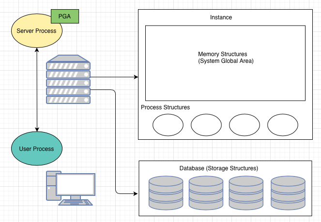
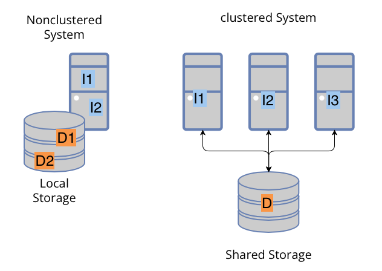
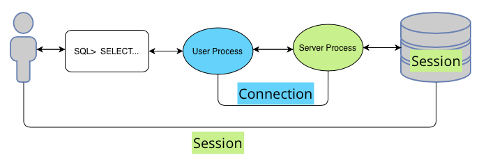
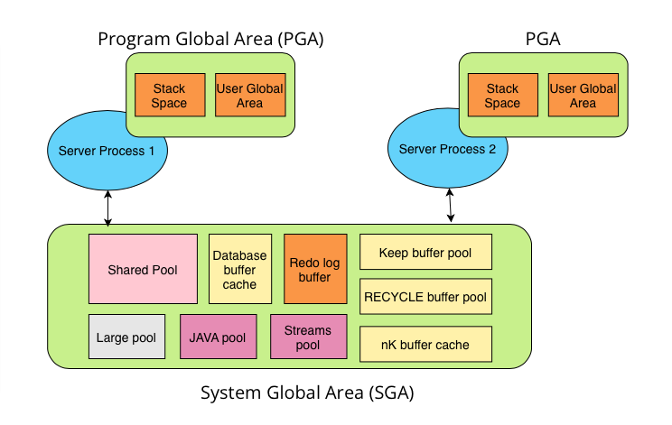

# Exploring the Oracle Database Architecture.
## Oracle Database是以儲存所有處理過的資料集合為一個單位。
#

## RDBMS : The Oracle Relational DataBase Management System
* RDBMS 提供開放、全面、綜合的資料管理方法。
* Oracle RDBMS 可靠的在多用戶環境中管理大量數據，讓許多用戶可以同時使用相同的數據，並且擁有非常高效率。與此同時，他可以防止未經授權的訪問，並為故障提供有效解決方案。
# ----------------------------------------------------------
## 連接server的方式：
### 使用者連接資料庫的方式有三種：
* 使用者登入運行oracle的os，利用oracle工具登入資料庫。
* 利用本機工具（例如：sqldeveloper）透過網路連接到oracle server，為client/server架構。利用網路連接使用者（client / front end) 及 oracle （server / back end)。 
* 使用者使用應用程式的介面操作oracle，運用該應用程式的server去連接oracle。
#
# ----------------------------------------------------------
## 傳統多層式架構的構成要素：
* 由用戶端或是起始程序啟動操作。
* 一或多個application server各自負責部分的操作。 Application server 包含很大部份的應用邏輯，且提供資料給用戶，並處理一些程序運算以減輕database server的負擔。Application server更可以作為用戶與Database server之間的接口，並提供額外的安全性。
* 儲存用戶在操作系統時的資訊。
#### 總而言之，這個架構可以協助系統做到下列事情：
- 協助驗證用戶端（例如 網頁瀏覽器）。
- 連接oracle db server。
- 履行用戶的操作。

# ----------------------------------------------------------

## OracleDB Server 架構總覽：

## Oracle DB server 架構主要有三個部分：
* memory structures
* process structures
* storage structures

## Oracle DB 組成：
主要是由兩個架構組成：實體架構以及邏輯架構。因此可以在存取實體架構資料時不影響邏輯架構的資料。

在memory structures的情境如下：當程序啟動時，SGA（System Global Area)會被分派出來，且background processes 會開始執行。processes是在memory中運作的程式，被定義為在機器或是OS中的thread of control。在開始database的部分後，the oracle software會與特定database相關聯，稱為掛載資料庫。等到資料庫準備好可以開啟了，有授權的用戶就可以開始使用了。

# ----------------------------------------------------------
## Database 結構及配置：

## Nonclustered System:
每一個應用只會對應一個DB，假設有很多DB在同一台Server上，那他們的應用以及DB會被區分開來。
## Clustered System:
A Real Applications Cluster(RAC) database 通常有好幾個應用在不同server上，並公用一個shared database。

# ----------------------------------------------------------
## 連線資料庫的差別：

## Connection:
在user's process 和 server's process 之間的溝通。
## Session:
user 開始sqlplus 開啟連線到中止連線，這整個過程就稱為session。

# ----------------------------------------------------------

## Oracle資料庫記憶體架構：
Oracle Database 建立與使用記憶體有很多不同的目的，例如，儲存執行中的程式、在使用者之中分享資料、提供資料區域給每一個使用者。

### 兩種基本記憶體架構：
* System Global Area (SGA): 共享記憶體群組，包含資料以及控制oracle DB instance 的資料。 SGA 是所有server 以及後端程序共用，儲存在SGA的資料包含cached data 以及 共享SQL區域。

* Program Global Areas (PGA): 記憶體空間內包含資料和server 或是 background process 的控制資訊。 PGA 是被oracle DB 在開始執行背景程序時創建的非共享記憶體空間，每一個server process 或是 background process 都有自己的PGA，
### Oracle DB Memory Structures
SGA 包含內容介紹：
-   Shared Pool: Shared pool緩存了多重程序數據的類型。舉個例子，sharedpool存儲瞭解析之後的SQL,PL/SQL代碼,系統參數,以及數據字典信息.數據庫中出現的每個操作幾乎都會涉及到shared pool

-   Database buffer cache: 又稱 buffercache，用來儲存從數據文件中讀取到的資料塊的拷貝，所有用戶連接到資料庫instance，以共享的方式訪問buffer cache。

-   KEEP buffer Pool: 這種池是爲訪問頻繁但總因爲默認池空間狹小總被換出的塊準備的，keep pool的目標是將對象保留在內存中，用來避免I/O操作。默認的塊大小是8KB
-   RECYCLE buffer Pool:  這種池爲不會頻繁使用的塊準備的。Recycle pool防止一些不必要對象在cache中消耗空間。
-   nK bufffer cache: cache使用了非標準塊大小的表空間而設置的2KB,4KB以及16KB的池。
-   Redo log buffer: Redo log buffer是在SGA中的一個循環buffer，它存放了redo條目，這些條目描述了數據庫中的修改。Redo entries（redo條目）包含重構或重做數據庫中所做的修改（通過DML或DDL）。數據庫在recovery過程中會應用redo entries到數據文件去重構丟失的更改。
-   Large Pool: Large pool是個可選內存區，它用來做內存分配。裏面分配的大小 往往比sharedpool中分配的要大。
-   Java Pool: Java pool是一個內存區域，存儲session相關的java代碼以及JavaVirtual Machine（JVM）中的數據。
-   Streams Pool: Streams pool存儲緩衝的隊列消息，以及提供OracleStreams 捕獲進程和應用進程所使用的內存。Streams pool被Oracle Streams獨立使用。

